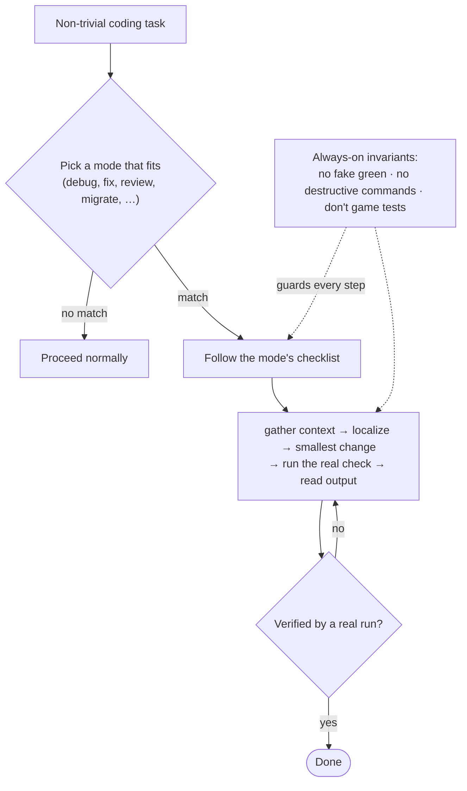

# Coding Posture

Task-aware working modes for coding agents. One `SKILL.md` file: before non-trivial work, the agent picks a mode — `debug`, `fix`, `review`, `test-first`, `refactor`, `optimize`, `migrate`, `upgrade`, `integrate`, `spike`, `unstuck` — and follows its checklist.

It exists to stop agents from behaving like optimistic elevators with write access: thrashing on a stuck bug, faking green tests, skipping reproduction, running destructive commands, migrating without a rollback.

**Works with** Hermes · Claude Code · Codex · Cursor · Pi — any [`SKILL.md`](https://hermes-agent.nousresearch.com/docs/user-guide/features/skills)-compatible agent.

## How the agent uses it



## Modes

| Mode         | Use when                                 | Core discipline                                     |
| ------------ | ---------------------------------------- | --------------------------------------------------- |
| `debug`      | failing test, bug, regression            | reproduce first, one hypothesis at a time           |
| `fix`        | small known urgent change                | smallest diff, no opportunistic cleanup             |
| `review`     | security/auth/payments, reviewing a diff | no approval without file/line evidence              |
| `test-first` | behavior change, tests practical         | see RED before implementing, never fake green       |
| `refactor`   | cleanup, simplify, rename                | preserve behavior, trace call sites before deleting |
| `optimize`   | performance work, hot path               | measure first, baseline before/after                |
| `migrate`    | schema/data/infra change                 | rollback path before touching state                 |
| `upgrade`    | dependency or version bump               | read breaking changes, no blind search-replace      |
| `integrate`  | calling an external API/service          | read the contract, handle the error paths           |
| `spike`      | prototype, PoC, unknown library          | isolate, end with a verdict                         |
| `unstuck`    | repeated failures, thrashing             | stop editing, summarize evidence, narrow hypotheses |

**Always — in every mode:**

- Verify by running the real check (test, build, repro); never by re-reading.
- Never report a result you didn't run; never weaken, delete, or game a test to go green.
- No destructive commands (`force push`, `reset --hard`, `drop`, `rm -rf`) without explicit scope.

## Install

Install as a **plugin** (one command, updates in place) or drop the skill in directly. It's a standard `SKILL.md` skill, so it works unmodified across compatible agents.

### Claude Code — plugin

```text
/plugin marketplace add alexei-led/coding-posture
/plugin install coding-posture@coding-posture
```

Update later with `/plugin marketplace update coding-posture` then `/reload-plugins`, or enable auto-update from the `/plugin` menu to refresh on startup.

### Codex CLI — plugin

```bash
git clone git@github.com:alexei-led/coding-posture.git
codex   # then: /plugins → add the local marketplace in ./coding-posture → install coding-posture
```

Or point Codex straight at the skill in `~/.codex/config.json`:

```json
{ "skills": ["/abs/path/to/coding-posture/skills/coding-posture"] }
```

Update later with `git pull`.

### Other agents

| Agent                             | Install                                                                                                                                                                                      |
| --------------------------------- | -------------------------------------------------------------------------------------------------------------------------------------------------------------------------------------------- |
| **Hermes**                        | Drop `skills/coding-posture/` into `~/.hermes/skills/` (auto-discovered). URL/hub install: see the [Hermes skills docs](https://hermes-agent.nousresearch.com/docs/guides/work-with-skills). |
| **Pi**                            | `pi install git:github.com/alexei-led/coding-posture`                                                                                                                                        |
| **Cursor / any `SKILL.md` agent** | Copy `skills/coding-posture/` into the agent's skills dir.                                                                                                                                   |

The agent activates the skill from its `description` when a coding task starts.

## How it works — theory and evidence

A skill is just text placed in the model's context. A worked procedure acts as an _in-context demonstration_: the model conditions its next tokens on the shown trajectory, not just the final answer — the same basis as chain-of-thought. No complete mechanistic theory of frontier-model reasoning exists yet, so treat this as a grounded substrate, not a proof.

Each design claim, and how strong the evidence actually is:

| Claim                                                   | Evidence strength                             | Sources                                                                                                                                                                                                                                                                                                                                                                                      |
| ------------------------------------------------------- | --------------------------------------------- | -------------------------------------------------------------------------------------------------------------------------------------------------------------------------------------------------------------------------------------------------------------------------------------------------------------------------------------------------------------------------------------------- |
| A checklist shifts behavior via in-context conditioning | Grounded substrate, not a full theory         | [CoT (Wei 2022)](https://arxiv.org/abs/2201.11903), [induction heads (Olsson 2022)](https://transformer-circuits.pub/2022/in-context-learning-and-induction-heads/index.html), [iteration heads (NeurIPS 2024)](https://proceedings.neurips.cc/paper_files/paper/2024/file/c50f8180ef34060ec59b75d6e1220f7a-Paper-Conference.pdf), [ICL/CoT (ICML 2024)](https://icml.cc/virtual/2024/38391) |
| Procedures beat personas                                | Supported guideline, not a law                | [personas don't help (Zheng 2024)](https://aclanthology.org/2024.findings-emnlp.888/), [self-consistency (2022)](https://arxiv.org/abs/2203.11171)                                                                                                                                                                                                                                           |
| The model self-selects the mode                         | Holds for strong models, not universal        | [Route-to-Reason (2025)](https://arxiv.org/abs/2505.19435)                                                                                                                                                                                                                                                                                                                                   |
| The checklists target the right levers                  | Highest-evidence levers + documented failures | [self-debug (Chen 2023)](https://arxiv.org/abs/2304.05128), [self-correction limits (Huang 2023)](https://arxiv.org/abs/2310.01798), [context-first (2026)](https://arxiv.org/abs/2604.02547), [verifier gaming (2026)](https://arxiv.org/abs/2604.15149)                                                                                                                                    |
| The skill helps                                         | +15pp in the eval — run it yourself           | [`eval/`](eval/)                                                                                                                                                                                                                                                                                                                                                                             |

Two deliberate consequences:

- **Procedures, not personas.** A persona ("act as an expert debugger") sets style; a procedure supplies structure the model can follow. So each mode is a checklist, not a character.
- **Small on purpose.** Instruction-following degrades as a prompt grows long and complex, so a short, followable procedure beats a long aspirational one. (The popular "~150–200 instructions" ceiling has no peer-reviewed source; the real effect is just degradation with length.)

## Where this fits

Frontier agents already do the basics (reproduce bugs, run tests, small diffs), and a good `CLAUDE.md`/`AGENTS.md` repeats them. This skill earns its place only as the **delta** — the anti-instincts agents get wrong by default (stop thrashing, don't game the grader, roll back before migrating, measure before optimizing, read the API contract) — plus a mode catalog too large to keep always-on.

Split the rules by how often they must fire:

| Layer                                     | What goes here                                                  | Why                                                         |
| ----------------------------------------- | --------------------------------------------------------------- | ----------------------------------------------------------- |
| **Always-on** — `CLAUDE.md` / `AGENTS.md` | the invariants ([`always-on-snippet.md`](always-on-snippet.md)) | must fire every turn; a conditional skill can miss-activate |
| **Conditional** — this skill              | the per-task mode checklists                                    | loaded only when relevant; too many to keep always-on       |

[Anthropic's skill guidance](https://platform.claude.com/docs/en/agents-and-tools/agent-skills/best-practices) is evaluation-driven: keep only what measurably closes a gap.

## Try it

Open source — clone it, drop the skill into your agent, and watch how it changes the work. In the behavioral eval ([`eval/`](eval/)) the skill scores **85% vs 70% without it (+15pp)**, with the urgent-auth case going 4/4 vs 2/4. Run the eval on your own model and tasks, [open an issue](https://github.com/alexei-led/coding-posture/issues) with what you find, or add a mode — contributions welcome.
